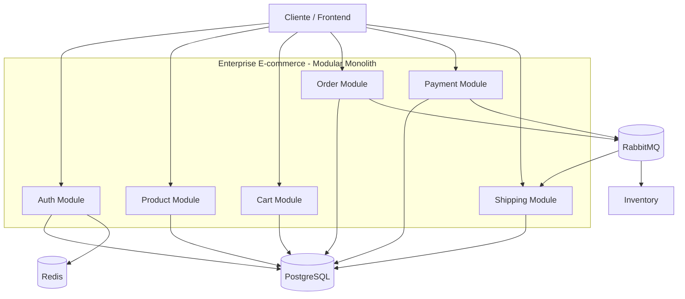
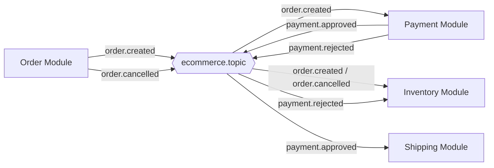
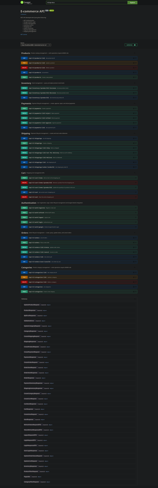
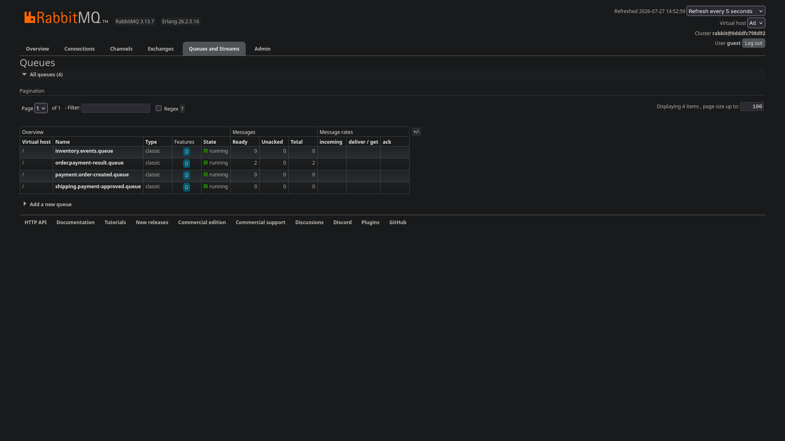
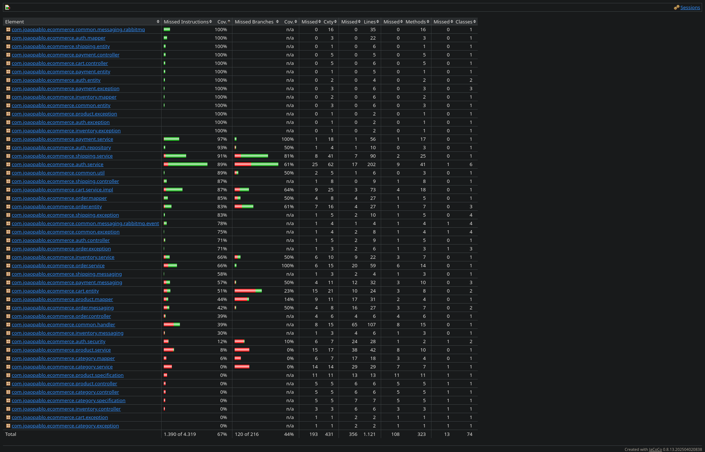
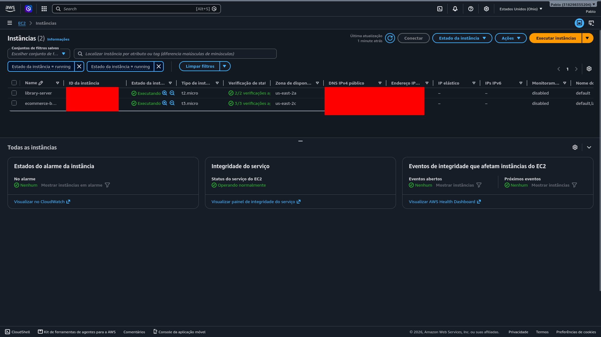
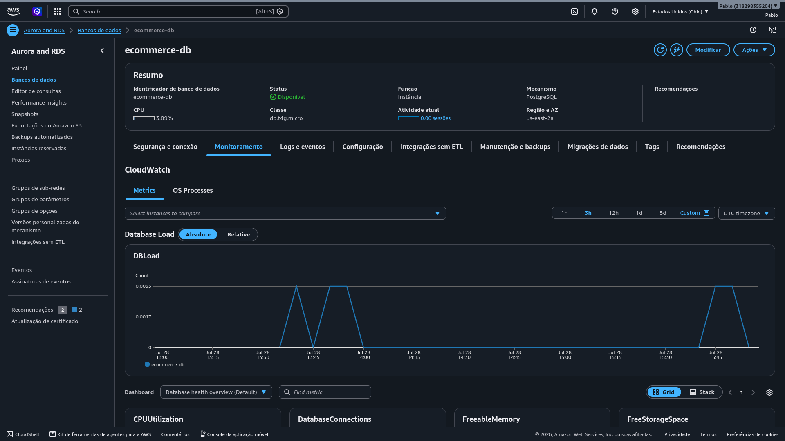
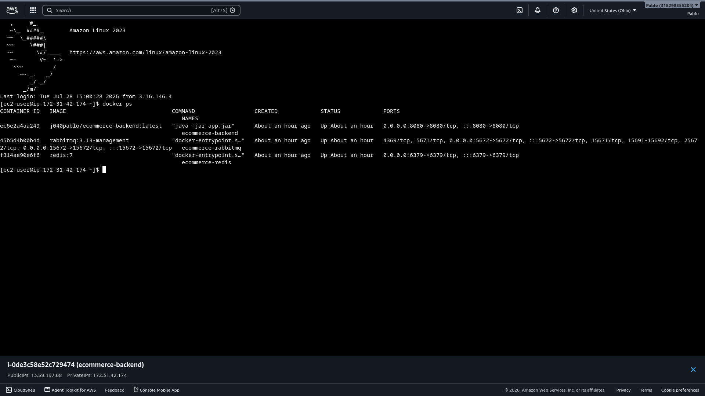
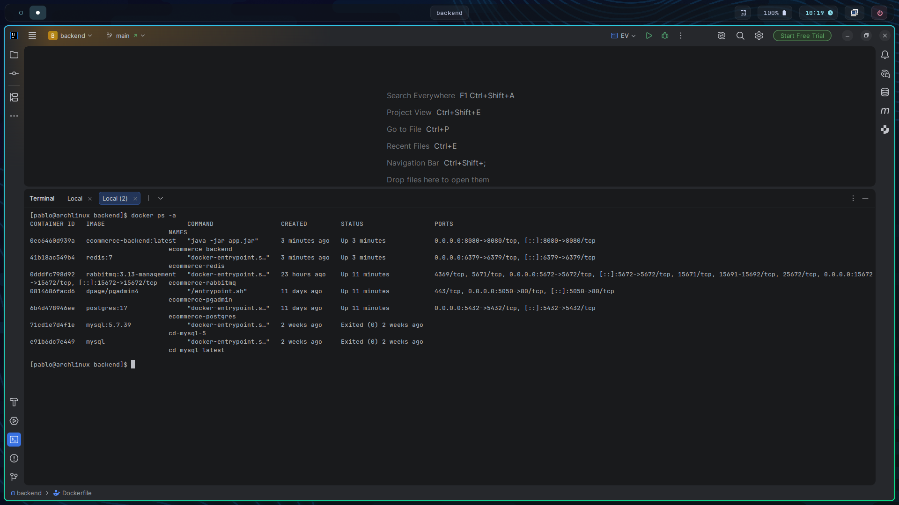

# Enterprise E-commerce API

<p align="center">
  <strong>API REST corporativa para e-commerce construída com Java 21, Spring Boot 3.5, segurança JWT/OAuth2, PostgreSQL, Redis, RabbitMQ e documentação OpenAPI.</strong>
</p>

<p align="center">
  
  
  
  
  
  
  
  
  
  
  
  
  
  
  
  
</p>

---

## Quickstart

Suba a infraestrutura e execute a aplicação em uma linha (desenvolvimento):

```bash
docker compose up -d && ./mvnw -DskipTests spring-boot:run
```

Exemplos rápidos (login e listar produtos):

```bash
# Login (retorna access token)
curl -s -X POST http://localhost:8080/api/v1/auth/login \
  -H 'Content-Type: application/json' \
  -d '{"email":"joao.pablo@email.com","password":"Senha@123"}'

# Listar produtos (use Authorization: Bearer <token> quando necessário)
curl -s http://localhost:8080/api/v1/products
```

---


---

## Features


- [x] Cadastro de usuários

- [x] Login com JWT

- [x] Login com Google OAuth2

- [x] Refresh token com rotação

- [x] Logout com revogação de refresh token

- [x] CRUD completo de Produtos, Categorias, Pedidos e Pagamentos

- [x] Controle de estoque

- [x] Carrinho de compras

- [x] Criação e consulta de pedidos

- [x] Aprovação, rejeição e estorno de pagamentos

- [x] Criação e acompanhamento de envios

- [x] Documentação Swagger/OpenAPI

- [x] Migrações versionadas com Flyway

- [x] Redis para cache/token store

- [x] RabbitMQ com exchange topic e eventos de domínio

- [x] Docker Compose

- [x] Deploy AWS

---

## Destaques

- **Java 21** + **Spring Boot 3.5** com arquitetura modular
- **Spring Security** com JWT e Google OAuth2
- **PostgreSQL 17** com migrações versionadas (Flyway)
- **Redis** para cache e gerenciamento de tokens
- **RabbitMQ** para arquitetura orientada a eventos
- **Docker Compose** para infraestrutura local completa
- **AWS** (EC2 + RDS) em produção
- **OpenAPI/Swagger** com documentação interativa
- **Testes automatizados** com cobertura 67%

---

## Sumário

- [Destaques](#destaques)
- [Stack](#stack)
- [Arquitetura](#arquitetura)
- [Módulos](#módulos)
- [Estrutura](#estrutura)
- [Fluxo de Dados](#fluxo-de-dados)
- [Como Executar](#como-executar)
- [API Documentation](#api-documentation)
- [Configuração](#configuração)
- [Docker](#docker)
- [Screenshots](#screenshots)
- [Deploy AWS](#deploy-aws)
- [Testes](#testes)
- [Links](#links)
- [Autor](#autor)

---

## 🛠️ Stack

| Categoria | Tecnologia | Uso |
| --- | --- | --- |
| Linguagem | Java 21 | Plataforma principal |
| Framework | Spring Boot 3.5 | API REST, runtime |
| Segurança | Spring Security | Autenticação, JWT, OAuth2 |
| Persistência | Spring Data JPA + PostgreSQL 17 | Banco relacional principal |
| Migrações | Flyway | Versionamento de schema |
| Cache | Redis | Token store, cache de dados |
| Mensageria | RabbitMQ + Spring AMQP | Eventos de domínio |
| Documentação | Springdoc OpenAPI | Swagger UI interativo |
| Build | Maven 3.x | Compilação e testes |
| Containerização | Docker Compose | Infraestrutura local |

---

## 🏗️ Arquitetura

**Padrão: Modular Monolith** - deploy único com código dividido por domínios bem definidos.



> O projeto segue o padrão **Modular Monolith**, organizando o domínio em módulos independentes dentro de uma única aplicação. Essa abordagem reduz o acoplamento, facilita a manutenção e permite evoluções futuras sem a complexidade inicial de uma arquitetura de microsserviços.

---

## 📦 Módulos

| Módulo | Responsabilidade |
| --- | --- |
| **auth** | Cadastro, login, JWT, OAuth2, logout |
| **product** | Catálogo de produtos |
| **category** | Categorias de produtos |
| **inventory** | Controle de estoque |
| **cart** | Carrinho de compras |
| **order** | Pedidos e status |
| **payment** | Pagamentos (criar, aprovar, rejeitar, estornar) |
| **shipping** | Envios e rastreamento |
| **common** | Configurações, exceções, mensageria |

---

## 📂 Estrutura

```
src/main/java/com/joaopablo/ecommerce
├── auth
├── cart
├── category
└── common
├── inventory
├── order
├── payment
├── product
├── shipping
```

---

## 🔄 Fluxo de Dados

### REST (Síncrono)


- Camadas: Controller → DTO → Service → Repository → DB
- Responsável por regras de negócio críticas
- Transações ACID garantidas

### Event-Driven (Assíncrono)




- **Exchange**: `ecommerce.topic` (Topic Exchange)
- **Routing Keys**: `order.created`, `payment.approved`, `payment.rejected`, `order.cancelled`
- **Objetivo**: Preparar para DLQ, retries, idempotência futura

---

## 🚀 Como Executar

### 1. Clone
```bash
git clone <repository-url>
cd enterprise-ecommerce/backend
```

### 2. Configuração
```bash
cp .env.example .env
# Edite .env com suas credenciais
```

### 3. Docker
```bash
docker compose up -d
```

### 4. Redis
Certifique-se de que Redis está rodando em `localhost:6379`

### 5. Build
```bash
./mvnw clean install
```

### 6. Executar
```bash
./mvnw spring-boot:run
```

API disponível em: `http://localhost:8080`

---

## 📚 API Documentation

### Swagger UI

OpenAPI JSON

Acesse: `http://localhost:8080/v3/api-docs`

**Recursos:**
- Explorar todos os endpoints
- Visualizar schemas de request/response
- Testar requisições com autenticação Bearer
- Gerar código cliente

### Autenticação

Para endpoints protegidos, clique em **Authorize** e informe:

```
Bearer <seu-access-token>
```

### Endpoints Principais

#### Auth
| Método | Endpoint | Descrição |
| --- | --- | --- |
| POST | `/api/v1/auth/register` | Registrar usuário |
| POST | `/api/v1/auth/login` | Login JWT |
| POST | `/api/v1/auth/refresh` | Renovar token |
| POST | `/api/v1/auth/logout` | Logout (revoga refresh token) |
| GET | `/api/v1/auth/google` | Login com Google OAuth2 |

#### Products
| Método | Endpoint | Descrição |
| --- | --- | --- |
| GET | `/api/v1/products` | Listar com paginação |
| POST | `/api/v1/products` | Criar produto |
| GET | `/api/v1/products/{id}` | Buscar por ID |
| PUT | `/api/v1/products/{id}` | Atualizar |
| DELETE | `/api/v1/products/{id}` | Deletar |

#### Orders
| Método | Endpoint | Descrição |
| --- | --- | --- |
| POST | `/api/v1/orders` | Criar pedido |
| GET | `/api/v1/orders` | Listar |
| GET | `/api/v1/orders/{id}` | Buscar por ID |
| PATCH | `/api/v1/orders/{id}/status` | Atualizar status |
| PATCH | `/api/v1/orders/{id}/cancel` | Cancelar |

#### Payments
| Método | Endpoint | Descrição |
| --- | --- | --- |
| POST | `/api/v1/payments` | Criar pagamento |
| GET | `/api/v1/payments/{id}` | Buscar por ID |
| PATCH | `/api/v1/payments/{id}/approve` | Aprovar |
| PATCH | `/api/v1/payments/{id}/reject` | Rejeitar |
| PATCH | `/api/v1/payments/{id}/refund` | Estornar |

#### Shipping
| Método | Endpoint | Descrição |
| --- | --- | --- |
| POST | `/api/v1/shippings` | Criar envio |
| GET | `/api/v1/shippings` | Listar |
| GET | `/api/v1/shippings/{id}` | Buscar por ID |
| PATCH | `/api/v1/shippings/{id}/ship` | Marcar como enviado |
| PATCH | `/api/v1/shippings/{id}/deliver` | Marcar como entregue |

---

## ⚙️ Configuração

**Variáveis de Ambiente Obrigatórias:**

```env
JWT_SECRET=seu-secret-forte-aqui
GOOGLE_CLIENT_ID=seu-client-id
GOOGLE_CLIENT_SECRET=seu-client-secret
```

**Opcionais:**

```env
RABBITMQ_HOST=localhost
RABBITMQ_PORT=5672
RABBITMQ_USERNAME=guest
RABBITMQ_PASSWORD=guest
```

**Serviços Locais:**

| Serviço | URL | Credenciais |
| --- | --- | --- |
| API | `http://localhost:8080` | - |
| Swagger | `http://localhost:8080/swagger-ui/index.html` | - |
| PostgreSQL | `localhost:5432/ecommerce` | postgres / postgres |
| PgAdmin | `http://localhost:5050` | admin@admin.com / admin |
| RabbitMQ Management | `http://localhost:15672` | guest / guest |
| Redis | `localhost:6379` | - |

---

## 🐳 Docker

A aplicação utiliza **Docker Compose** para provisionar toda a infraestrutura necessária ao ambiente de desenvolvimento.

### Arquitetura

```text
                 Docker Compose

               ┌───────────────┐
               │  Spring Boot  │
               └───────┬───────┘
                       │
        ┌──────────────┼──────────────┐
        │              │              │
        ▼              ▼              ▼
 ┌──────────┐   ┌──────────┐   ┌────────────┐
 │PostgreSQL│   │  Redis   │   │ RabbitMQ   │
 └──────────┘   └──────────┘   └────────────┘
        │
        ▼
 ┌──────────┐
 │ PgAdmin  │
 └──────────┘
```

### Iniciar a infraestrutura

```bash
docker compose up -d
```

### Containers Provisionados

| Serviço | Imagem | Porta |
|----------|---------|------:|
| Spring Boot API | Local Build | 8080 |
| PostgreSQL | `postgres:17` | 5432 |
| PgAdmin | `dpage/pgadmin4` | 5050 |
| Redis | `redis:7` | 6379 |
| RabbitMQ | `rabbitmq:3.13-management` | 5672 / 15672 |

### Parar a infraestrutura

```bash
docker compose down
```

O Docker Compose simplifica o ambiente de desenvolvimento, garantindo que banco de dados, cache, mensageria e ferramentas administrativas sejam iniciados de forma consistente com um único comando.

## 🖼️ Screenshots

Ferramentas principais utilizadas para desenvolvimento, monitoramento e testes.

### Swagger UI - Documentação Interativa



Interface OpenAPI gerada automaticamente pelo Springdoc, permitindo explorar endpoints, visualizar modelos, validar payloads e testar requisições com autenticação Bearer integrada.

---

### RabbitMQ Management - Painel Administrativo



Console web do RabbitMQ para monitorar exchanges, visualizar filas, inspecionar bindings por routing key e acompanhar taxa de publicação/consumo de mensagens em tempo real.

---

### JaCoCo Coverage - Relatório de Cobertura



Análise de cobertura de código revelando quais linhas foram executadas durante testes, com métricas detalhadas (67% instructions, 44% branches, 74% classes, 66% methods).

---

## ☁️ Deploy AWS

A aplicação foi preparada para execução em ambiente de produção utilizando serviços da AWS.

### Arquitetura da Infraestrutura

```text
                    Internet
                        │
                        ▼
            ┌────────────────────┐
            │ Amazon EC2          │
            │ Spring Boot + Docker│
            └──────────┬──────────┘
                       │
        ┌──────────────┼──────────────┐
        │              │              │
        ▼              ▼              ▼
 ┌────────────┐  ┌──────────┐  ┌────────────┐
 │Amazon RDS  │  │  Redis   │  │ RabbitMQ   │
 │PostgreSQL  │  │  Cache   │  │ Messaging  │
 └────────────┘  └──────────┘  └────────────┘
```

A API é executada em uma instância **Amazon EC2**, enquanto o banco de dados utiliza o **Amazon RDS PostgreSQL**. Redis é responsável pelo cache e gerenciamento de tokens, e RabbitMQ pela comunicação orientada a eventos.

---

### Amazon EC2



Instância Linux responsável pela execução da aplicação Spring Boot containerizada com Docker.

---

### Amazon RDS PostgreSQL



Banco de dados PostgreSQL gerenciado pela AWS, oferecendo persistência, backups automáticos e snapshots.

---

### Sessão na EC2 (containers)



Sessão na instância EC2 listando os containers em execução (API, RabbitMQ e Redis).

---

### Containers em Execução



Containers responsáveis pela API e pelos serviços auxiliares utilizados pela aplicação.

---

### Acesso

**Swagger Local**

```
http://localhost:8080/swagger-ui/index.html
```

**Swagger Produção**

```
http://13.59.197.68:8080/swagger-ui/index.html
```

## ✅ Testes

A qualidade da aplicação é garantida por testes automatizados cobrindo autenticação, regras de negócio e endpoints REST.

### Ferramentas Utilizadas

| Ferramenta | Uso |
|------------|-----|
| **JUnit 5** | Testes unitários |
| **Mockito** | Mocks e isolamento de dependências |
| **MockMvc** | Testes de integração dos endpoints REST |
| **JaCoCo** | Relatórios de cobertura de código |

### Cobertura

- Autenticação JWT e OAuth2
- Refresh Token e Logout
- Endpoints REST
- Regras de negócio
- Tratamento de exceções

### Executar os testes

```bash
./mvnw test
./mvnw clean install
```

### Métricas (JaCoCo)

| Métrica | Cobertura |
|----------|----------:|
| Instructions | **67%** |
| Branches | **44%** |
| Classes | **74%** |
| Methods | **66%** |

O relatório JaCoCo permite identificar áreas críticas da aplicação e acompanhar a evolução da cobertura de testes ao longo do desenvolvimento.

## 🔗 Links

- **GitHub:** [J040Pablo/enterprise-ecommerce](https://github.com/J040Pablo/enterprise-ecommerce)
- **Frontend:** [frontend/README.md](../frontend/README.md)
- **Swagger Produção:** [http://13.59.197.68:8080/swagger-ui/index.html](http://13.59.197.68:8080/swagger-ui/index.html)
- **Swagger Local:** `http://localhost:8080/swagger-ui/index.html`
- **RabbitMQ Management:** `http://localhost:15672`
- **PgAdmin:** `http://localhost:5050`

---

## 👨‍💻 Autor

**João Pablo**

Backend Developer | Java | Spring Boot

Especializado em desenvolvimento de APIs REST utilizando Java e Spring Boot, com foco em arquitetura de software, segurança, mensageria e cloud.

### Contato

- [GitHub](https://github.com/J040Pablo)
- [LinkedIn](https://linkedin.com/in/joaopablodelgadogomes)
