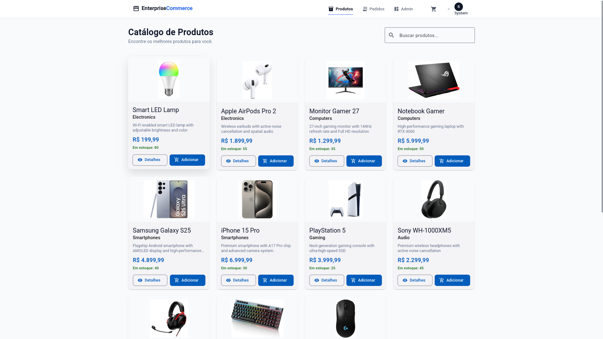
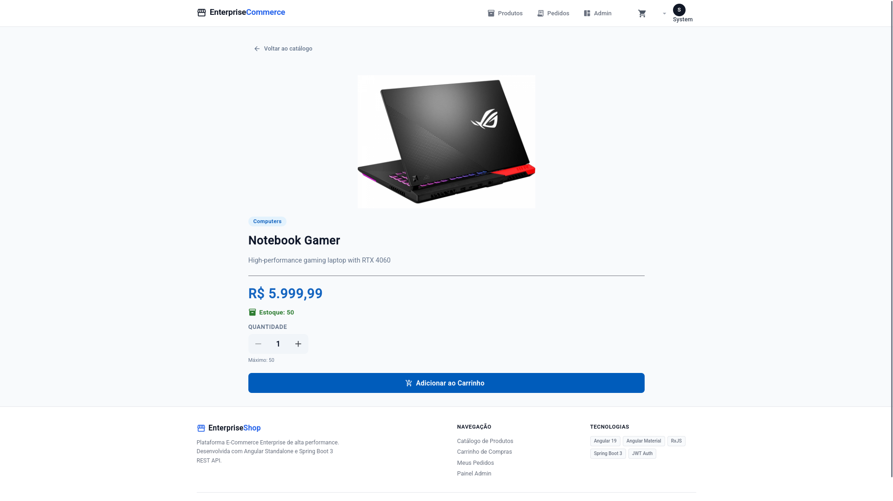
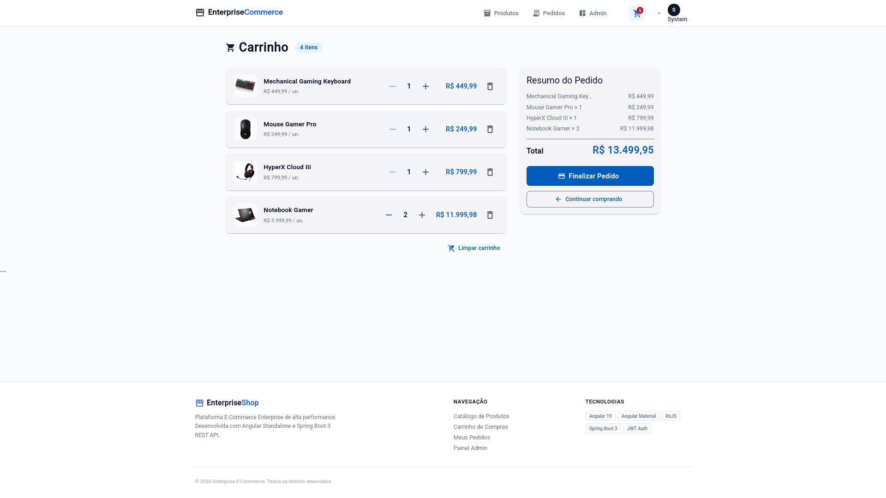
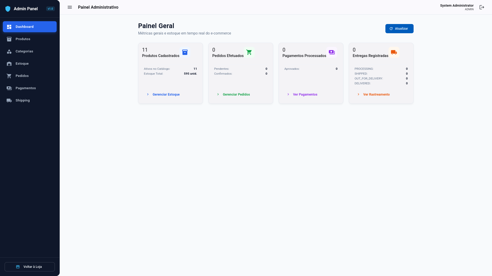
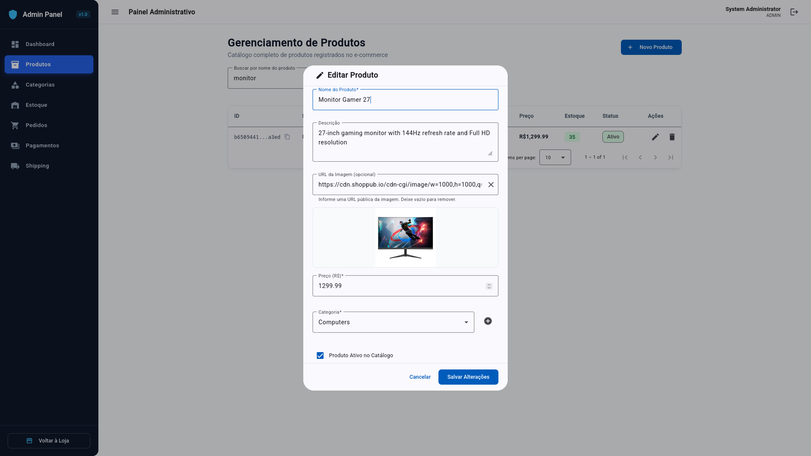
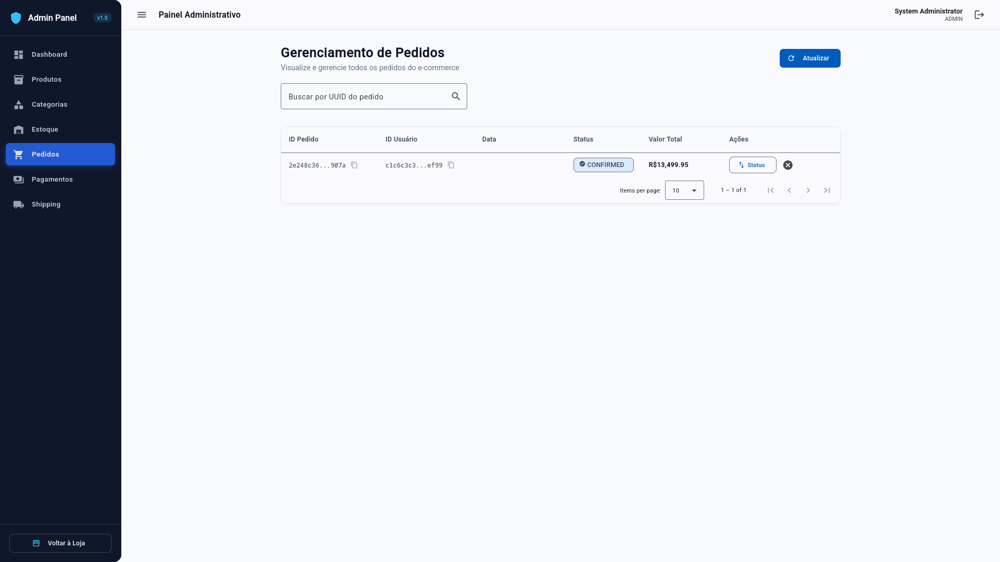
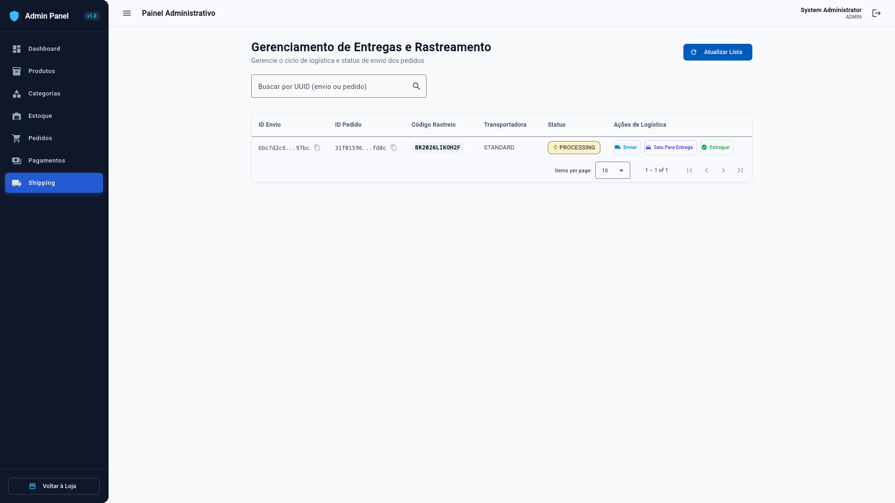

# Enterprise E-commerce — Frontend

SPA Angular que consome a API REST do backend Spring Boot: catálogo, autenticação JWT/OAuth2, carrinho, checkout, pedidos e painel administrativo.

<p align="center">
  
  
  
  
  
  
  
  
  
  
  
  
  
</p>

---

## 📚 Sumário

- [Overview](#overview)
- [Features](#features)
- [Screenshots](#screenshots)
- [Tech Stack](#tech-stack)
- [Architecture](#architecture)
- [Project Structure](#project-structure)
- [Prerequisites](#prerequisites)
- [Installation](#installation)
- [Environment Variables](#environment-variables)
- [Running Locally](#running-locally)
- [Production Build](#production-build)
- [Docker](#docker)
- [API Integration](#api-integration)
- [Authentication](#authentication)
- [Main User Flows](#main-user-flows)
- [Development](#development)
- [Testing](#testing)
- [Build / CI](#build--ci)
- [Related Projects](#related-projects)

---

## Overview

Este frontend é a interface do monorepo **Enterprise E-commerce**. Em desenvolvimento, aponta para a API em `http://localhost:8080`. Em produção (Docker Compose), o nginx serve o build estático e faz reverse proxy de `/api` e OAuth2 para o serviço `backend`.

Documentação da API: [backend/README.md](../backend/README.md)

## Features

Funcionalidades implementadas no código atual:

### Loja (cliente)

- Catálogo de produtos com busca por nome, paginação e status de estoque
- Detalhe do produto (imagem, categoria, preço, estoque e quantidade)
- Carrinho: adicionar, alterar quantidade, remover e limpar
- Carrinho local (`localStorage`) para visitante; sincronização com a API quando autenticado
- Checkout e confirmação de pedido (rotas protegidas)
- Meus pedidos (lista do usuário autenticado)
- Login e cadastro com e-mail/senha (JWT)
- Login com Google OAuth2 (callback + troca de código por tokens)
- Refresh de access token e logout com revogação do refresh token

### Área administrativa (`/admin`, role `ADMIN`)

- Dashboard com métricas de produtos, pedidos, pagamentos e envios
- CRUD de produtos e categorias
- Gestão de estoque (aumento, redução e definição de quantidade)
- Gestão de pedidos (listagem, atualização de status, cancelamento)
- Gestão de pagamentos (aprovar, rejeitar, estornar)
- Gestão de envios e rastreamento (enviar, saiu para entrega, entregue)

## 🖼️ Screenshots

Principais telas da aplicação web. Imagens em [`docs/images/`](../docs/images/).

### Catálogo de Produtos

Listagem paginada do catálogo com busca por nome, cards de produto (imagem, categoria, preço e estoque) e ações para ver detalhes ou adicionar ao carrinho.



---

### Detalhes do Produto

Página de detalhe com imagem, categoria, descrição, preço, disponibilidade em estoque, seletor de quantidade e adição ao carrinho.



---

### Carrinho de Compras

Carrinho com itens, ajuste de quantidade, remoção, resumo do pedido e fluxo para finalizar a compra ou continuar navegando no catálogo.



---

### Painel Administrativo

Dashboard do Admin Panel com métricas de produtos, pedidos, pagamentos e entregas, além de atalhos para as áreas de gestão.



---

### Edição de Produto

Gerenciamento de produtos no admin: tabela com busca e paginação, e formulário modal para editar nome, descrição, imagem, preço, categoria e status ativo.



---

### Gestão de Pedidos

Listagem administrativa de pedidos com busca por UUID, status, valor total e ações para atualizar status ou cancelar.



---

### Rastreamento de Envios

Gestão de entregas e rastreamento: código de rastreio, transportadora, status do envio e ações logísticas (enviar, saiu para entrega, entregue).



## Tech Stack

| Tecnologia | Versão / nota |
| --- | --- |
| Angular | 19 (standalone components, lazy loading) |
| TypeScript | ~5.6 |
| Angular Material / CDK | 19 |
| RxJS | ~7.8 |
| Zone.js | ~0.15 |
| Node.js | `^18.19.1 \|\| ^20.11.1 \|\| >=22` (imagem Docker: Node 22) |
| npm | lockfile v3 (`package-lock.json`) |
| nginx | 1.27-alpine (imagem de produção) |
| Docker | multi-stage build do frontend |

Estado local relevante usa **Angular Signals** (auth, carrinho, loading/erro nas telas). Não há NgRx nem outro store global.

## Architecture

Organização por **features** (domínio da UI) + **core** (infra compartilhada) + **shared** (layout e componentes reutilizáveis).

- **Standalone components** e rotas com `loadChildren` / `loadComponent`
- **Functional guards** (`authGuard`, `adminGuard`) e **functional interceptor** (`authInterceptor`)
- HTTP via `HttpClient` + `provideHttpClient(withFetch(), withInterceptors(...))`
- Configuração de API por `environment` / `environment.development`

### Camadas

| Camada | Responsabilidade |
| --- | --- |
| `features/` | Páginas e fluxos (auth, products, cart, checkout, orders, admin) |
| `core/services/` | Integração HTTP com a API |
| `core/models/` | Tipos TypeScript alinhados aos DTOs da API |
| `core/guards/` | Proteção de rotas (autenticado / ADMIN) |
| `core/interceptors/` | Bearer token e refresh em `401` |
| `shared/` | Header, footer, diálogos e utilitários de UI |
| `environments/` | Base URL da API por ambiente |

## Project Structure

```text
frontend/
├── Dockerfile
├── nginx.conf
├── angular.json
├── package.json
├── public/
└── src/
    ├── environments/
    │   ├── environment.ts                 # produção: apiUrl = '/api/v1'
    │   └── environment.development.ts     # local: http://localhost:8080/api/v1
    ├── main.ts
    └── app/
        ├── app.config.ts
        ├── app.routes.ts
        ├── core/
        │   ├── guards/
        │   ├── interceptors/
        │   ├── models/
        │   └── services/
        ├── features/
        │   ├── auth/          # login, register, OAuth callback
        │   ├── products/      # list + detail
        │   ├── cart/
        │   ├── checkout/      # checkout + confirmation
        │   ├── orders/        # pedidos do usuário
        │   └── admin/         # dashboard, products, categories,
        │                      # inventory, orders, payments, shipping
        └── shared/
            ├── components/
            └── layout/        # header, footer
```

Pastas vazias legadas (`features/account`, `features/categories`, `core/auth`, `core/config`) não possuem implementação ativa. O componente `home` existe no código, mas **não está registrado nas rotas**; a rota raiz redireciona para `/products`.

## Prerequisites

- **Node.js** 18.19+, 20.11+ ou 22+ (recomendado: 22, alinhado ao Dockerfile)
- **npm** 9+ (o repositório usa `package-lock.json`)
- **Backend** em execução para fluxos que dependem da API ([backend/README.md](../backend/README.md))
- **Docker** (opcional) para build/execução containerizada

Angular CLI global é opcional: os scripts usam o CLI local via `npm` / `npx`.

## Installation

```bash
cd frontend
npm ci
# ou: npm install
```

## Environment Variables

O frontend **não** usa arquivo `.env`. A base da API está em:

| Arquivo | Uso | `apiUrl` |
| --- | --- | --- |
| `src/environments/environment.development.ts` | `ng serve` / build development | `http://localhost:8080/api/v1` |
| `src/environments/environment.ts` | build production | `/api/v1` (mesmo origin + proxy nginx) |

Variáveis de OAuth2, JWT, banco e CORS ficam no **backend** (veja `backend/.env.example`). Em desenvolvimento, o backend deve permitir a origin `http://localhost:4200` e o redirect OAuth `http://localhost:4200/auth/callback`.

## Running Locally

Com a API disponível em `http://localhost:8080`:

```bash
cd frontend
npm start
# equivalente: npx ng serve
```

Aplicação em: [http://localhost:4200](http://localhost:4200)

A configuração `serve` padrão usa o build **development** (com `fileReplacements` para `environment.development.ts`).

## Production Build

```bash
cd frontend
npm run build
# equivalente: npx ng build
# produção explícita: npx ng build --configuration=production
```

Artefatos em `dist/enterprise-ecommerce-frontend/` (browser bundle sob `browser/` no builder `application`).

## Docker

### Imagem standalone

```bash
cd frontend
docker build -t ecommerce-frontend:latest .
docker run --rm -p 80:80 ecommerce-frontend:latest
```

A imagem:

1. Faz `npm ci` e `ng build --configuration=production` (Node 22)
2. Serve o resultado com nginx (SPA fallback + proxy `/api`, `/oauth2`, `/login/oauth2` → `http://backend:8080`)

O proxy exige um serviço Docker chamado `backend` na mesma rede (como no compose de produção).

### Stack de produção (monorepo)

A partir de `backend/`:

```bash
cd backend
docker compose -f docker-compose.prod.yml up -d --build
```

O serviço `frontend` publica a porta **80** e encaminha a API para o container `backend`. Detalhes de variáveis obrigatórias: [backend/README.md](../backend/README.md) e `backend/.env.example`.

O `docker-compose.yml` de desenvolvimento sobe infraestrutura + backend; o frontend local costuma rodar com `npm start` na porta 4200.

## API Integration

| Ambiente | Base URL |
| --- | --- |
| Desenvolvimento | `http://localhost:8080/api/v1` |
| Produção (nginx) | `/api/v1` (relative; proxy para o backend) |

Serviços HTTP em `core/services/`:

| Serviço | Prefixo principal |
| --- | --- |
| `AuthService` | `/auth` |
| `ProductService` | `/products` |
| `CategoryService` | `/categories` |
| `CartService` | `/cart` |
| `OrderService` | `/orders` |
| `PaymentService` | `/payments` |
| `ShippingService` | `/shippings` |
| `InventoryService` | `/api/inventory` (fora do prefixo `/api/v1`) |

## Authentication

1. **Login JWT** — `POST /auth/login` → access + refresh tokens e dados do usuário em `localStorage`
2. **Registro** — `POST /auth/register`
3. **Google OAuth2** — redirecionamento para `/auth/google`; callback em `/auth/callback`; troca do código via `POST /auth/oauth/exchange` (tokens não viajam na URL de redirect)
4. **Interceptor** — anexa `Authorization: Bearer <access_token>`; em `401`, tenta refresh e repete a requisição; se falhar, limpa a sessão e redireciona para login
5. **Guards** — `authGuard` em checkout e pedidos; `adminGuard` exige role `ADMIN` / `ROLE_ADMIN`

## Main User Flows

### Compra

```text
Login (opcional no catálogo) → /products → /products/:id
  → Carrinho → /checkout (auth) → confirmação → /orders
```

### Administração

```text
Login (ADMIN) → /admin/dashboard
  → produtos / categorias / estoque / pedidos / pagamentos / shipping
```

## Development

- Preferir components standalone e lazy routes já adotados no projeto
- Tipar requests/responses com os models em `core/models`
- Manter a lógica HTTP nos services; componentes cuidam de UI e estado reativo
- SCSS por componente; tema Material pré-configurado: `azure-blue`
- Após mudanças de API no backend, alinhar models e services do frontend

## Testing

Existem specs Karma/Jasmine gerados pelo CLI (`app`, `home`, `header`, `footer`, `cart`). Cobertura ampla de features **não** está implementada.

```bash
cd frontend
npm test
```

## Build / CI

O workflow em [`.github/workflows/ci.yml`](../.github/workflows/ci.yml) executa **apenas** o backend (`mvn clean verify`). Não há pipeline de CI para o frontend neste repositório.

## Related Projects

| Documento | Conteúdo |
| --- | --- |
| [README da raiz](../README.md) | Overview do monorepo |
| [backend/README.md](../backend/README.md) | API Spring Boot, Docker, deploy AWS |
| [`docs/images/`](../docs/images/) | Screenshots compartilhados |
